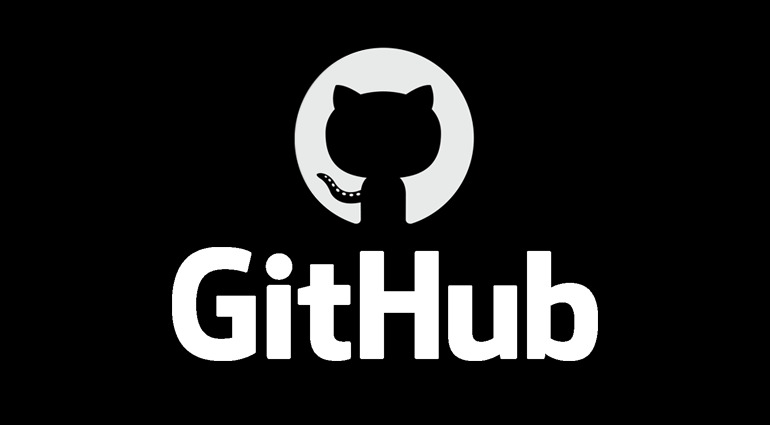

# Torneios FC



<p align="center">
  
  
  <a href="https://github.com/josueplacido/keeper/commits/master">
    
  </a>
  
   <a href="https://github.com/tgmarinho/nlw1/stargazers">
    
  </a>
  
  


</p>

## Sobre o projeto

⚽ Torneios FC, permite criar e gerenciar campeonatos de diferentes regulamentos
de maneira simples e inuitiva, além de dispor de um aplicativo móvel para facilitar o compartilhamento das estatísticas do campeonato, como classificação e lista de artilheiros.

Que tal mostrar para seus amigos que vc eh o homem gol da sua cidade? 😎

## Screenshots

🚧 em construção 🚧

## :link: Links e demos

Prótótipo BETA que está sendo refatorado
[torneiosfc](josueplacido1-001-site2.btempurl.com).

🚧 em construção 🚧

## Tabela de conteúdos

=================

-   [Sobre](#sobre-o-projeto)
-   [Screenshot](#screenshots)
-   [Links e demos](#link-links-e-demos)
-   [Tabela de Conteudo](#tabela-de-conteúdos)
-   [Funcionalidades](#funcionalidades)

    -   [Site](#site)
        -   [Backend](#backend)
        -   [Frontend](#frontend)
    -   [Aplicativo](#site)

-   [Instalação](#instalação)
    -   [Pre Requisitos](#pré-requisitos)
    -   [Backend](#rodando-o-backend)
    -   [Frontend](#rodando-o-frontend)
    -   [Mobile](#rodando-o-mobile)
    -   [Tests](#rodando-os-testes)
-   [Tecnologias](#tecnologias)
-   [Conceitos e padrões](#conceitos-e-padrões)
-   [Autor](#autor)
-   [Licença](#licença)

## Funcionalidades

Estão listadas abaixo algumas funcionalidades previstas e o andamento delas para esta primeira versão:

### Site

#### Backend

-   [x] Criar campeonato
-   [x] Alterar plantel dos times inscritos
-   [x] Gerenciar Jogadores
-   [x] Gerenciar Times
-   [x] Alterar estatísticas e rank
-   [x] Editar Agenda de jogos
-   [x] Renomear itens gerados Grupos, Fases e jogos
-   [x] Registrar súmula
-   [x] Atualiar campeonato automaticamente conforme for necessário após o registro de súmula
-   [x] Montar fases posteriores

### Frontend

-   [ ] Criar campeonato
-   [ ] Alterar plantel dos times inscritos
-   [ ] Gerenciar Jogadores
-   [ ] Gerenciar Times
-   [ ] Alterar estatísticas e rank
-   [ ] Editar Agenda de jogos
-   [ ] Renomear itens gerados Grupos, Fases e jogos
-   [ ] Registrar súmula
-   [ ] Atualiar campeonato automaticamente conforme for necessário após o registro de súmula

### Aplicativo

-   [ ] Exibir os jogos do dia
-   [ ] Exibir a agenda de jogos de cada campeonato
-   [ ] Exibir os artilheiros de cada campeonato
-   [ ] Exibir a tabela de classificação e chaveamento de cada campeonato
-   [ ] Exibir os jogadores com mais prêmios MVP
-   [ ] Exibir os jogadores com mais cartões amarelos e vermelhos MVP

## Instalação

Este projeto é divido em três partes:

1. Backend (pasta api)
2. Frontend (pasta web)
3. Mobile (pasta mobile)

💡Tanto o Frontend quanto o Mobile precisam que o Backend esteja sendo executado para funcionar.

### Pré-requisitos

Antes de começar, você vai precisar ter instalado em sua máquina as seguintes ferramentas:

-   [Git](https://git-scm.com);
-   [Node.js](https://nodejs.org/en/);
-   [SDK .NET Core 5.0](https://dotnet.microsoft.com/download);
-   [SQL Server](https://www.microsoft.com/pt-br/sql-server/sql-server-downloads);
-   Editor ou IDE de sua preferência. Recomendo o [VSCode](https://code.visualstudio.com/) ou [Visual Studio](https://visualstudio.microsoft.com/)

#### Rodando o Backend

Ajuste a connectionStrings no arquivo "appsettings.development.json" que está na pasta "projects/api" para o SQLServer local

```bash

# Clone este repositório
$ git clone git@github.com:josueplacido/keeper.git

# Acesse a pasta do projeto no terminal/cmd
$ cd projects/api

# Instale as dependências
$ npm install

# Execute a aplicação em modo de desenvolvimento
$ npm run start

```

#### Rodando o Frontend

```bash

# Clone este repositório
$ git clone git@github.com:josueplacido/keeper.git

# Acesse a pasta do projeto no terminal/cmd
$ cd projects/web

# Instale as dependências
$ npm install

# Execute a aplicação em modo de desenvolvimento
$ npm run start

# verifique o endereco da api e a porta em src/services/api.ts
# o padrao é localhost:3333
```

#### Rodando o Mobile

🚧 Em construção 🚧

#### Rodando os testes

Para rodar os testes de unidade, integração e EndToEnd do BANCKEND:

```bash

# Acesse a pasta do projeto de teste no terminal/cmd
$ cd projects/test

# Execute a aplicação em modo de desenvolvimento
$ dotnet test

```

## Tecnologias

-   Net Core 5.0
-   Swagger
-   SQL Server
-   VS CODE
-   NPM
-   YARN
-   JSON
-   REACT
-   REACT NATIVE
-   STYLED-COMPONENTS
-   TYPESCRIPT
-   HTML
-   CSS/SASS
-   GIT
-   AZURE BOARDS
-   ENTITY-FRAMEWORK

## Conceitos e padrões

Lista de conceitos, padrões, técnicas e metodologias estudada e/ou aplicada no projeto.

-   POO
-   DDD
-   MONOREPO
-   FACTORY
-   KANBAN
-   CLEAN ARCHITETURE

---

## Autor

<a alt="Linkedin" href="https://linkedin/in/josueplacido">
 
 <br />
 <sub><b>Josué Placido</b></sub></a>

Feito com ❤️ por Josué Placido 👋🏽 Entre em contato!

[](https://www.linkedin.com/in/josueplacido/)
[](mailto:juplacido.jnr@gmail.com)
[](mailto:ozzyplacidojunior@hotmail.com)

## 📝 Licença

Este projeto esta sobe a licença [MIT](./LICENSE).
